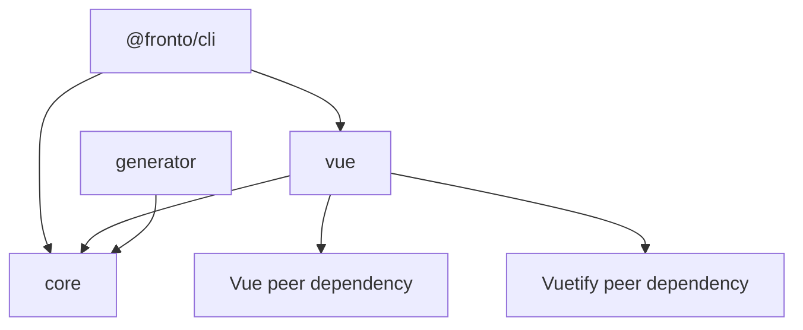

Fronto will be a single TypeScript/pnpm monorepo, with independently publishable packages: @backo-stricto/fronto-core, @backo-stricto/fronto-vue, @backo-stricto/fronto-cli, @backo-stricto/fronto-generator.

Packages will be named thereafter by their short names `core`, `vue`, `cli`, `generator`.

Vue 3 and Vuetify are the only initial UI targets. Application component generation from a Backo server is explicitly deferred.

Package responsibilities

| Package   | Responsibility                                                                                                                        | Must not contain                                       |
| --------- | ------------------------------------------------------------------------------------------------------------------------------------- | ------------------------------------------------------ |
| core      | Framework-neutral field schema, type identifiers, constraints, serialization, validation result types, and recursive Dict definitions | Vue, Vuetify, DOM APIs, API requests, Backo CRUD       |
| vue       | Vue SFC widgets, Vuetify implementation, field registry, composables, and source manifest for copied components                       | HTTP client, Backo metadata fetching, global app state |
| cli       | Node CLI and fronto init command                                                                                                      | Vue widget logic, application component generation     |
| generator | Minimal publishable placeholder workspace for now                                                                                     | Any speculative generator architecture                 |

Package `core`
This is the generic package. It must not depend on React, Vue, JSX, DOM APIs, or component templates.

It owns the stable Backo-facing contract:

HTTP client and API endpoint conventions;
Backo \_meta, \_check, CRUD, actions, selections, and OpenAPI handling;
normalized internal schema representation;
Stricto/Backo type mapping;
permissions, conditional visibility, computed/read-only fields;
validation, query, pagination, error, and relation abstractions;
framework-independent component intent, such as DisplayField, EditField, ListCell, and ReferencePicker.
This is the most valuable shared layer, and the part least suitable for duplication.

Package `generator`
This package converts a Backo application description into a framework-neutral generation plan.

For example, it determines:

a User model needs display, edit, list, and picker representations;
name maps to a string field;
age maps to a constrained numeric field;
a Ref relation needs a lookup/picker;
a computed field is displayed but excluded from editable payloads;
context-dependent metadata needs runtime evaluation.
It should not directly write React JSX or Vue templates. It should produce a normalized intermediate representation that framework renderers consume.

Package `vue`
This is the first actual frontend implementation.

It should reuse `core` and the neutral generation plan, while providing:

- Vue composables and providers;
- Vue widgets;
- Vue-specific component templates/renderers.

It must not reimplement Backo metadata normalization, REST behavior, rights logic, or schema mapping.

Package `cli`
This contains the init and generate commands.

init selects an adapter, such as React, then copies the adapter’s basic component source into the consuming application.
generate fetches Backo metadata/OpenAPI, invokes the generic generator, then invokes the chosen adapter’s renderer.
The CLI should select the frontend implementation explicitly, for example through an option such as --adapter react, rather than detecting framework conventions unpredictably.
